export const Swatch = ({children, color}) => (
  

    {children}
  

);

Our colors are light and quiet in the background, but shine bright for important or active elements in the foreground.  
## Tokens
We organize our tokens into color palette tokens, theme tokens including neutrals/grays, and state tokens. The color palette tokens are the complete set of colors available. Theme tokens are a smaller subset of all available tokens and customized to the main use cases.
## Color and accessibility
The effects of color on people are neither consistent nor predictable across all people, and color insensitivity can make it difficult to distinguish hues for some people. We are commited to complying with AA standard contrast ratios (4.5:1). To do so, choose colors that support usability by ensuring sufficient color contrast between background and foreground elements so that people with low vision - be it temporary, situational or permanent - can see and use the interface.  

### Accessible color pairings
Our color system helps you to choose accessible color pairings. Each color from the color palette has a grade assigned to the name (like `gray-50`), which represents its luminance:  
  

  
The grade can be used for calculating color contrast as defined by WCAG guidelines for level AA for any 2 colors in this color system by subtracting their grades from each other:
- difference of **40+** for **large text* and graphics/UI-components** (contrast ratio at least **3:1**)
- difference of **50+** for **normal text** (contrast ratio at least **4.5:1**)

*) Large text is defined as (at least) 14 pt (= typically 19px) bold or 18 pt (= typically 24px).  

#### Accessible color combination examples

## Color palettes
We crafted our color palettes based on human perception, following the LCh color space to be perceptually uniform. For designers, all our color palettes are ready to use and available as tokens in Figma [Grape DS Color Palette](https://www.figma.com/file/CmAKUTCCenvjpYuBP6Krlg/Grape-DS-Color-Palette).

### Monochrome
#### Black & White
<!-- 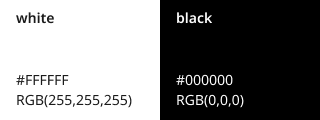 -->
| Color | Palette token | HEX | RGB
| :-- | :-- | :-- | :-- |
| <Swatch color="#ffffff"></Swatch> | `white` | #ffffff | 255,255,255
| <Swatch color="#000000"></Swatch> | `black` | #000000 | 0,0,0

#### Gray
<!--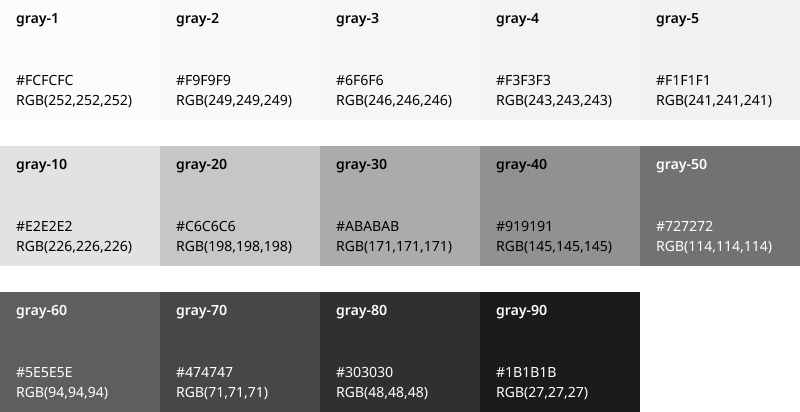-->
| Color | Palette token | HEX | RGB
| :-- | :-- | :-- | :-- |
| <Swatch color="#fcfcfc"></Swatch> | `gray-1` | #fcfcfc | 252,252,252
| <Swatch color="#f9f9f9"></Swatch> | `gray-2` | #f9f9f9 | 249,249,249
| <Swatch color="#f6f6f6"></Swatch> | `gray-3` | #f6f6f6 | 246,246,246
| <Swatch color="#f3f3f3"></Swatch> | `gray-4` | #f3f3f3 | 243,243,243
| <Swatch color="#f1f1f1"></Swatch> | `gray-5` | #f1f1f1 | 241,241,241
| <Swatch color="#e2e2e2"></Swatch> | `gray-10` | #e2e2e2 | 226,226,226
| <Swatch color="#c6c6c6"></Swatch> | `gray-20` | #c6c6c6 | 198,198,198
| <Swatch color="#ababab"></Swatch> | `gray-30` | #ababab | 171,171,171
| <Swatch color="#919191"></Swatch> | `gray-40` | #919191 | 145,145,145
| <Swatch color="#727272"></Swatch> | `gray-50` | #727272 | 114,114,114
| <Swatch color="#5e5e5e"></Swatch> | `gray-60` | #5e5e5e | 94,94,94
| <Swatch color="#474747"></Swatch> | `gray-70` | #474747 | 71,71,71
| <Swatch color="#303030"></Swatch> | `gray-80` | #303030 | 48,48,48
| <Swatch color="#1b1b1b"></Swatch> | `gray-90` | #1b1b1b | 27,27,27
#### Gray warm
<!--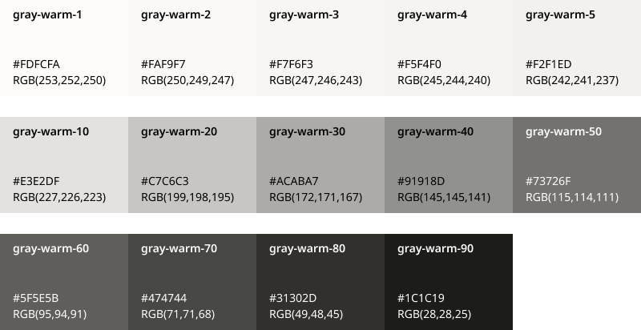-->
| Color | Palette token | HEX | RGB
| :-- | :-- | :-- | :-- |
| <Swatch color="#fdfcfa"></Swatch> | `gray-warm-1` | #fdfcfa | 253,252,250
| <Swatch color="#faf9f7"></Swatch> | `gray-warm-2` | #faf9f7 | 250,249,247
| <Swatch color="#f7f6f3"></Swatch> | `gray-warm-3` | #f7f6f3 | 247,246,243
| <Swatch color="#f5f4f0"></Swatch> | `gray-warm-4` | #f5f4f0 | 245,244,240
| <Swatch color="#f2f1ed"></Swatch> | `gray-warm-5` | #f2f1ed | 242,241,237
| <Swatch color="#e3e2df"></Swatch> | `gray-warm-10` | #e3e2df | 227,226,223
| <Swatch color="#c7c6c3"></Swatch> | `gray-warm-20` | #c7c6c3 | 199,198,195
| <Swatch color="#acaba7"></Swatch> | `gray-warm-30` | #acaba7 | 172,171,167
| <Swatch color="#91918d"></Swatch> | `gray-warm-40` | #91918d | 145,145,141
| <Swatch color="#73726f"></Swatch> | `gray-warm-50` | #73726f | 115,114,111
| <Swatch color="#5f5e5b"></Swatch> | `gray-warm-60` | #5f5e5b | 95,94,91
| <Swatch color="#474744"></Swatch> | `gray-warm-70` | #474744 | 71,71,68
| <Swatch color="#31302d"></Swatch> | `gray-warm-80` | #31302d | 49,48,45
| <Swatch color="#1c1c19"></Swatch> | `gray-warm-90` | #1c1c19 | 28,28,25
### Colors vivid
#### Purple
<!--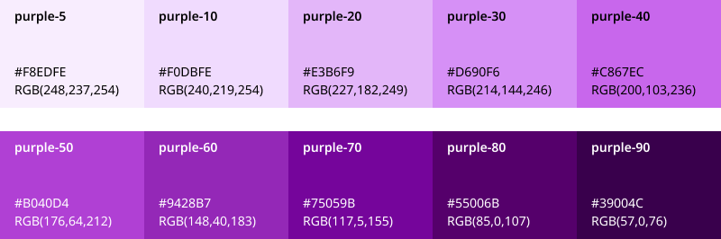-->
| Color | Palette token | HEX | RGB
| :-- | :-- | :-- | :-- |
| <Swatch color="#f8edfe"></Swatch> | `purple-5` | #f8edfe | 248,237,254
| <Swatch color="#f0dbfe"></Swatch> | `purple-10` | #f0dbfe | 240,219,254
| <Swatch color="#e3b6f9"></Swatch> | `purple-20` | #e3b6f9 | 227,182,249
| <Swatch color="#d690f6"></Swatch> | `purple-30` | #d690f6 | 214,144,246
| <Swatch color="#c867ec"></Swatch> | `purple-40` | #c867ec | 200,103,236
| <Swatch color="#b040d4"></Swatch> | `purple-50` | #b040d4 | 176,64,212
| <Swatch color="#9428b7"></Swatch> | `purple-60` | #9428b7 | 148,40,183
| <Swatch color="#75059b"></Swatch> | `purple-70` | #75059b | 117,5,155
| <Swatch color="#55006b"></Swatch> | `purple-80` | #55006b | 85,0,107
| <Swatch color="#39004c"></Swatch> | `purple-90` | #39004c | 57,0,76
#### Blue
<!--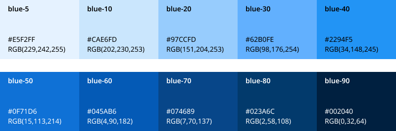-->
| Color | Palette token | HEX | RGB
| :-- | :-- | :-- | :-- |
| <Swatch color="#e5f2ff"></Swatch> | `blue-5` | #e5f2ff | 229,242,255
| <Swatch color="#cae6fd"></Swatch> | `blue-10` | #cae6fd | 202,230,253
| <Swatch color="#97ccfd"></Swatch> | `blue-20` | #97ccfd | 151,204,253
| <Swatch color="#62b0fe"></Swatch> | `blue-30` | #62b0fe | 98,176,254
| <Swatch color="#2294f5"></Swatch> | `blue-40` | #2294f5 | 34,148,245
| <Swatch color="#0f71d6"></Swatch> | `blue-50` | #0f71d6 | 15,113,214
| <Swatch color="#045ab6"></Swatch> | `blue-60` | #045ab6 | 4,90,182
| <Swatch color="#074689"></Swatch> | `blue-70` | #074689 | 7,70,137
| <Swatch color="#023a6c"></Swatch> | `blue-80` | #023a6c | 82,58,108
| <Swatch color="#002040"></Swatch> | `blue-90` | #002040 | 0,32,64
#### Pink
<!--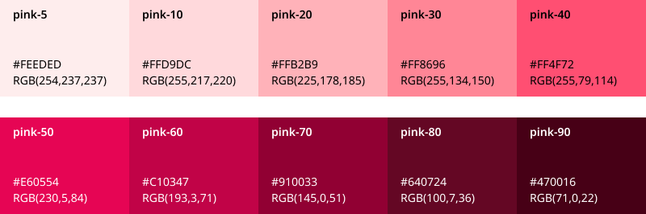-->
| Color | Palette token | HEX | RGB
| :-- | :-- | :-- | :-- |
| <Swatch color="#feeded"></Swatch> | `pink-5` | #feeded | 254,237,237
| <Swatch color="#ffd9dc"></Swatch> | `pink-10` | #ffd9dc | 255,217,220
| <Swatch color="#ffb2b9"></Swatch> | `pink-20` | #ffb2b9 | 225,178,185
| <Swatch color="#ff8696"></Swatch> | `pink-30` | #ff8696 | 255,134,150
| <Swatch color="#ff4f72"></Swatch> | `pink-40` | #ff4f72 | 255,79,114
| <Swatch color="#e60554"></Swatch> | `pink-50` | #e60554 | 230,5,84
| <Swatch color="#c10347"></Swatch> | `pink-60` | #c10347 | 193,3,71
| <Swatch color="#910033"></Swatch> | `pink-70` | #910033 | 145,0,51
| <Swatch color="#640724"></Swatch> | `pink-80` | #640724 | 100,7,36
| <Swatch color="#470016"></Swatch> | `pink-90` | #470016 | 71,0,22
#### Lime
<!--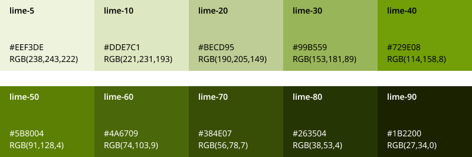-->
| Color | Palette token | HEX | RGB
| :-- | :-- | :-- | :-- |
| <Swatch color="#eef3de"></Swatch> | `lime-5` | #eef3de | 238,243,222
| <Swatch color="#dde7c1"></Swatch> | `lime-10` | #dde7c1 | 221,231,193
| <Swatch color="#becd95"></Swatch> | `lime-20` | #becd95 | 190,205,149
| <Swatch color="#99b559"></Swatch> | `lime-30` | #99b559 | 153,181,89
| <Swatch color="#729e08"></Swatch> | `lime-40` | #729e08 | 114,158,8
| <Swatch color="#5b8004"></Swatch> | `lime-50` | #5b8004 | 91,128,4
| <Swatch color="#4a6709"></Swatch> | `lime-60` | #4a6709 | 71,103,9
| <Swatch color="#384e07"></Swatch> | `lime-70` | #384e07 | 56,78,7
| <Swatch color="#263504"></Swatch> | `lime-80` | #263504 | 38,53,4
| <Swatch color="#1b2200"></Swatch> | `lime-90` | #1b2200 | 27,34,0
#### Red
<!--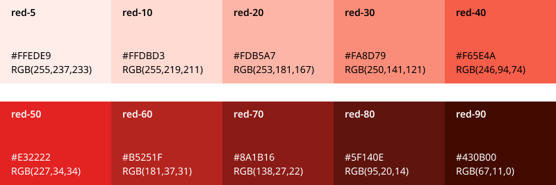-->
| Color | Palette token | HEX | RGB
| :-- | :-- | :-- | :-- |
| <Swatch color="#ffede9"></Swatch> | `red-5` | #ffede9 | 255,237,233
| <Swatch color="#ffdbd3"></Swatch> | `red-10` | #ffdbd3 | 255,219,211
| <Swatch color="#fdb5a7"></Swatch> | `red-20` | #fdb5a7 | 253,181,167
| <Swatch color="#fa8d79"></Swatch> | `red-30` | #fa8d79 | 250,141,121
| <Swatch color="#f65e4a"></Swatch> | `red-40` | #f65e4a | 246,94,74
| <Swatch color="#e32222"></Swatch> | `red-50` | #e32222 | 227,34,34
| <Swatch color="#b5251f"></Swatch> | `red-60` | #b5251f | 181,37,31
| <Swatch color="#8a1b16"></Swatch> | `red-70` | #8a1b16 | 138,27,22
| <Swatch color="#5f140e"></Swatch> | `red-80` | #5f140e | 95,20,14
| <Swatch color="#430b00"></Swatch> | `red-90` | #430b00 | 67,11,0
#### Orange
<!--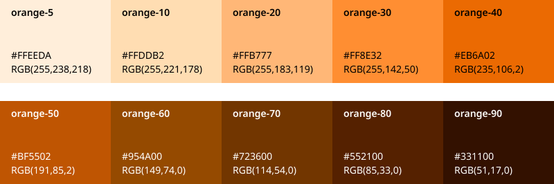-->
| Color | Palette token | HEX | RGB
| :-- | :-- | :-- | :-- |
| <Swatch color="#ffeeda"></Swatch> | `orange-5` | #ffeeda | 255,238,218
| <Swatch color="#ffddb2"></Swatch> | `orange-10` | #ffddb2 | 255,221,178
| <Swatch color="#ffb777"></Swatch> | `orange-20` | #ffb777 | 255,183,119
| <Swatch color="#ff8e32"></Swatch> | `orange-30` | #ff8e32 | 255,142,50
| <Swatch color="#eb6a02"></Swatch> | `orange-40` | #eb6a02 | 235,106,2
| <Swatch color="#bf5502"></Swatch> | `orange-50` | #bf5502 | 191,85,2
| <Swatch color="#954a00"></Swatch> | `orange-60` | #954a00 | 149,74,0
| <Swatch color="#723600"></Swatch> | `orange-70` | #723600 | 114,54,0
| <Swatch color="#552100"></Swatch> | `orange-80` | #552100 | 85,33,0
| <Swatch color="#331100"></Swatch> | `orange-90` | #331100 | 51,17,0
#### Gold
<!--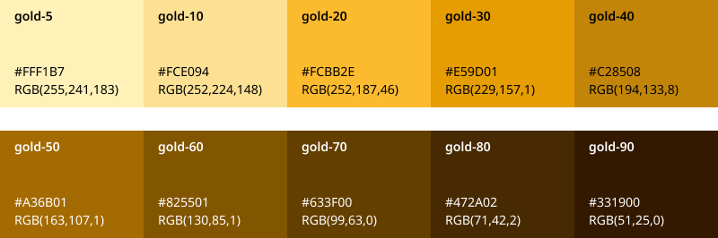-->
| Color | Palette token | HEX | RGB
| :-- | :-- | :-- | :-- |
| <Swatch color="#fff1b7"></Swatch> | `gold-5` | #fff1b7 | 255,241,183
| <Swatch color="#fce094"></Swatch> | `gold-10` | #fce094 | 252,224,148
| <Swatch color="#fcbb2e"></Swatch> | `gold-20` | #fcbb2e | 252,187,46
| <Swatch color="#e59d01"></Swatch> | `gold-30` | #e59d01 | 229,157,1
| <Swatch color="#c28508"></Swatch> | `gold-40` | #c28508 | 194,133,8
| <Swatch color="#a36b01"></Swatch> | `gold-50` | #a36b01 | 163,107,1
| <Swatch color="#825501"></Swatch> | `gold-60` | #825501 | 130,85,1
| <Swatch color="#633f00"></Swatch> | `gold-70` | #633f00 | 99,63,0
| <Swatch color="#472a02"></Swatch> | `gold-80` | #472a02 | 71,42,2
| <Swatch color="#331900"></Swatch> | `gold-90` | #331900 | 51,25,0
## Color tokens
Each color token is drawn from a color palette token. We only use token-based colors in all of our components.
### Neutrals
Neutral tokens are divided into `base-bw`, `base` and `base-warm`. Neutrals (except black and white) have eight possible lightness grades, from ghost to darkest.  
#### Base BW
<!---->
| Color | Token | Palette token | HEX | RGB
| :-- | :-- | :-- | :-- | :-- |
| <Swatch color="#ffffff"></Swatch> | `base-bw-white` | white | #ffffff | 255,255,255
| <Swatch color="#000000"></Swatch> | `base-bw-black` | black | #000000 | 0,0,0
#### Base
<!-- 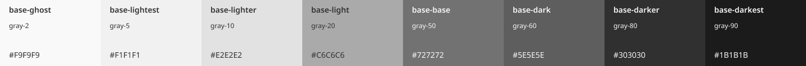 -->
| Color | Token | Palette token | HEX | RGB
| :-- | :-- | :-- | :-- | :-- |
| <Swatch color="#f9f9f9"></Swatch> | `base-ghost` | gray-2 | #f9f9f9 | 249,249,249
| <Swatch color="#f1f1f1"></Swatch> | `base-lightest` | gray-5 | #f1f1f1 | 241,241,241
| <Swatch color="#e2e2e2"></Swatch> | `base-lighter` | gray-10 | #e2e2e2 | 226,226,226
| <Swatch color="#c6c6c6"></Swatch> | `base-light` | gray-20 | #c6c6c6 | 198,198,198
| <Swatch color="#727272"></Swatch> | `base-base` | gray-50 | #727272 | 114,114,114
| <Swatch color="#5e5e5e"></Swatch> | `base-dark` | gray-60 | #5e5e5e | 94,94,94
| <Swatch color="#303030"></Swatch> | `base-darker` | gray-80 | #303030 | 48,48,48
| <Swatch color="#1b1b1b"></Swatch> | `base-darkest` | gray-90 | #1b1b1b | 27,27,27
#### Base warm
<!-- 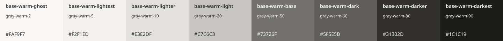 -->
| Color | Token | Palette token | HEX | RGB
| :-- | :-- | :-- | :-- | :-- |
| <Swatch color="#faf9f7"></Swatch> | `base-warm-ghost` | gray-warm-2 | #faf9f7 | 250,249,247
| <Swatch color="#f2f1ed"></Swatch> | `base-warm-lightest` | gray-warm-5 | #f2f1ed | 242,241,237
| <Swatch color="#e3e2df"></Swatch> | `base-warm-lighter` | gray-warm-10 | #e3e2df | 227,226,223
| <Swatch color="#c7c6c3"></Swatch> | `base-warm-light` | gray-warm-20 | #c7c6c3 | 199,198,195
| <Swatch color="#73726f"></Swatch> | `base-warm-base` | gray-warm-50 | #73726f | 115,114,111
| <Swatch color="#5f5e5b"></Swatch> | `base-warm-dark` | gray-warm-60 | #5f5e5b | 95,94,91
| <Swatch color="#31302d"></Swatch> | `base-warm-darker` | gray-warm-80 | #31302d | 49,48,45
| <Swatch color="#1c1c19"></Swatch> | `base-warm-darkest` | gray-warm-90 | #1c1c19 | 28,28,25
### Theme
Theme color tokens are designed to be useful in our product. Theme tokens are divided into `primary`, `secondary`, `personal` and `accent`. The **personal** color is used for everything that relates to the person interacting with our product themselves, be it their personal space or their own message. Each color family has seven possible lightness grades, from lightest to darkest.    
#### Primary
<!-- 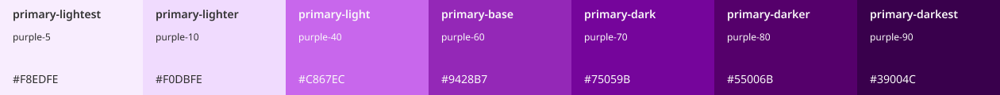 -->
| Color | Token | Palette token | HEX | RGB
| :-- | :-- | :-- | :-- | :-- |
| <Swatch color="#f8edfe"></Swatch> | `primary-lightest` | purple-5 | #f8edfe | 248,237,254
| <Swatch color="#f0dbfe"></Swatch> | `primary-lighter` | purple-10 | #f0dbfe | 240,219,254
| <Swatch color="#c867ec"></Swatch> | `primary-light` | purple-40 | #c867ec | 200,103,236
| <Swatch color="#9428b7"></Swatch> | `primary-base` | purple-60 | #9428b7 | 148,40,183
| <Swatch color="#75059b"></Swatch> | `primary-dark` | purple-70 | #75059b | 117,5,155
| <Swatch color="#55006b"></Swatch> | `primary-darker` | purple-80 | #55006b | 85,0,107
| <Swatch color="#39004c"></Swatch> | `primary-darkest` | purple-90 | #39004c | 57,0,76
#### Secondary
<!-- 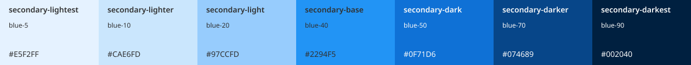 -->
| Color | Token | Palette token | HEX | RGB
| :-- | :-- | :-- | :-- | :-- |
| <Swatch color="#e5f2ff"></Swatch> | `secondary-lightest` | blue-5 | #e5f2ff | 229,242,255
| <Swatch color="#cae6fd"></Swatch> | `secondary-lighter` | blue-10 | #cae6fd | 202,230,253
| <Swatch color="#97ccfd"></Swatch> | `secondary-light` | blue-20 | #97ccfd | 151,204,253
| <Swatch color="#2294f5"></Swatch> | `secondary-base` | blue-40 | #2294f5 | 34,148,245
| <Swatch color="#0f71d6"></Swatch> | `secondary-dark` | blue-50 | #0f71d6 | 15,113,214
| <Swatch color="#074689"></Swatch> | `secondary-darker` | blue-70 | #074689 | 7,70,137
| <Swatch color="#002040"></Swatch> | `secondary-darkest` | blue-90 | #002040 | 0,32,64
#### Personal
<!-- 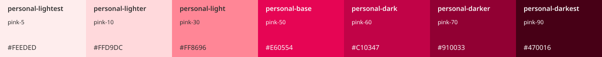 -->
| Color | Token | Palette token | HEX | RGB
| :-- | :-- | :-- | :-- | :-- |
| <Swatch color="#feeded"></Swatch> | `personal-lightest` | pink-5 | #feeded | 254,237,237
| <Swatch color="#ffd9dc"></Swatch> | `personal-lightr` | pink-10 | #ffd9dc | 255,217,220
| <Swatch color="#ff8696"></Swatch> | `personal-light` | pink-30 | #ff8696 | 255,134,150
| <Swatch color="#e60554"></Swatch> | `personal-base` | pink-50 | #e60554 | 230,5,84
| <Swatch color="#c10347"></Swatch> | `personal-dark` | pink-60 | #c10347 | 193,3,71
| <Swatch color="#910033"></Swatch> | `personal-darker` | pink-70 | #910033 | 145,0,51
| <Swatch color="#470016"></Swatch> | `personal-darkest` | pink-90 | #470016 | 71,0,22
#### Accent
<!-- 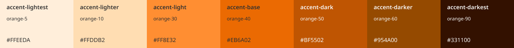 -->
| Color | Token | Palette token | HEX | RGB
| :-- | :-- | :-- | :-- | :-- |
| <Swatch color="#ffeeda"></Swatch> | `accent-lightest` | orange-5 | #ffeeda | 255,238,218
| <Swatch color="#ffddb2"></Swatch> | `accent-lighter` | orange-10 | #ffddb2 | 255,221,178
| <Swatch color="#ff8e32"></Swatch> | `accent-light` | orange-30 | #ff8e32 | 255,142,50
| <Swatch color="#eb6a02"></Swatch> | `accent-base` | orange-40 | #eb6a02 | 235,106,2
| <Swatch color="#bf5502"></Swatch> | `accent-dark` | orange-50 | #bf5502 | 191,85,2
| <Swatch color="#954a00"></Swatch> | `accent-darker` | orange-60 | #954a00 | 149,74,0
| <Swatch color="#331100"></Swatch> | `accent-darkest` | orange-90 | #331100 | 51,17,0
### States
State tokens are useful for states and alerts. They are divided into 5 state-roles: `positive`, `negative`, `warning`, `info`, and `disabled`. Each state token group except disabled has seven possible lightness grades, from lightest to darkest.  
#### Positive
<!-- 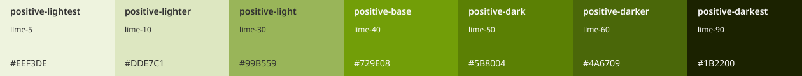 -->
| Color | Token | Palette token | HEX | RGB
| :-- | :-- | :-- | :-- | :-- |
| <Swatch color="#eef3de"></Swatch> | `positive-lightest` | lime-5 | #eef3de | 238,243,222
| <Swatch color="#dde7c1"></Swatch> | `positive-lighter` | lime-10 | #dde7c1 | 221,231,193
| <Swatch color="#99b559"></Swatch> | `positive-light` | lime-30 | #99b559 | 153,181,89
| <Swatch color="#729e08"></Swatch> | `positive-base` | lime-40 | #729e08 | 114,158,8
| <Swatch color="#5b8004"></Swatch> | `positive-dark` | lime-50 | #5b8004 | 91,128,4
| <Swatch color="#4a6709"></Swatch> | `positive-darker` | lime-60 | #4a6709 | 71,103,9
| <Swatch color="#1b2200"></Swatch> | `positive-darkest` | lime-90 | #1b2200 | 27,34,0
#### Negative
<!-- 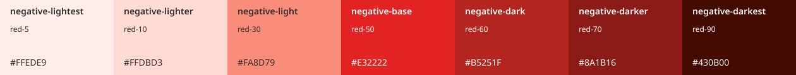 -->
| Color | Token | Palette token | HEX | RGB
| :-- | :-- | :-- | :-- | :-- |
| <Swatch color="#ffede9"></Swatch> | `negative-lightest` | red-5 | #ffede9 | 255,237,233
| <Swatch color="#ffdbd3"></Swatch> | `negative-lighter` | red-10 | #ffdbd3 | 255,219,211
| <Swatch color="#fa8d79"></Swatch> | `negative-light` | red-30 | #fa8d79 | 250,141,121
| <Swatch color="#e32222"></Swatch> | `negative-base` | red-50 | #e32222 | 227,34,34
| <Swatch color="#b5251f"></Swatch> | `negative-dark` | red-60 | #b5251f | 181,37,31
| <Swatch color="#8a1b16"></Swatch> | `negative-darker` | red-70 | #8a1b16 | 138,27,22
| <Swatch color="#430b00"></Swatch> | `negative-darkest` | red-90 | #430b00 | 67,11,0
#### Warning
<!-- 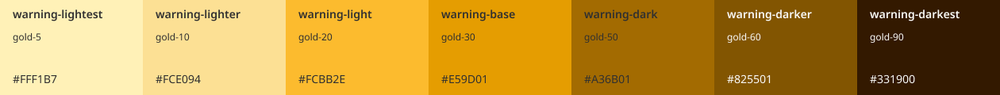 -->
| Color | Token | Palette token | HEX | RGB
| :-- | :-- | :-- | :-- | :-- |
| <Swatch color="#fff1b7"></Swatch> | `warning-lightest` | gold-5 | #fff1b7 | 255,241,183
| <Swatch color="#fce094"></Swatch> | `warning-lighter` | gold-10 | #fce094 | 252,224,148
| <Swatch color="#fcbb2e"></Swatch> | `warning-light` | gold-20 | #fcbb2e | 252,187,46
| <Swatch color="#e59d01"></Swatch> | `warning-base` | gold-30 | #e59d01 | 229,157,1
| <Swatch color="#a36b01"></Swatch> | `warning-dark` | gold-50 | #a36b01 | 163,107,1
| <Swatch color="#825501"></Swatch> | `warning-darker` | gold-60 | #825501 | 130,85,1
| <Swatch color="#331900"></Swatch> | `warning-darkest` | gold-90 | #331900 | 51,25,0
#### Info
<!-- 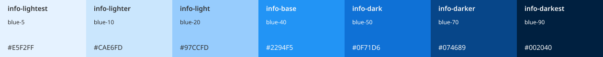 -->
| Color | Token | Palette token | HEX | RGB
| :-- | :-- | :-- | :-- | :-- |
| <Swatch color="#e5f2ff"></Swatch> | `info-lightest` | blue-5 | #e5f2ff | 229,242,255
| <Swatch color="#cae6fd"></Swatch> | `info-lighter` | blue-10 | #cae6fd | 202,230,253
| <Swatch color="#97ccfd"></Swatch> | `info-light` | blue-20 | #97ccfd | 151,204,253
| <Swatch color="#2294f5"></Swatch> | `info-base` | blue-40 | #2294f5 | 34,148,245
| <Swatch color="#0f71d6"></Swatch> | `info-dark` | blue-50 | #0f71d6 | 15,113,214
| <Swatch color="#074689"></Swatch> | `info-darker` | blue-70 | #074689 | 7,70,137
| <Swatch color="#002040"></Swatch> | `info-darkest` | blue-90 | #002040 | 0,32,64
#### Disabled
<!--  -->
| Color | Token | Palette token | HEX | RGB
| :-- | :-- | :-- | :-- | :-- |
| <Swatch color="#f9f9f9"></Swatch> | `disabled-ghost` | gray-2 | #f9f9f9 | 249,249,249
| <Swatch color="#e2e2e2"></Swatch> | `disabled-light` | gray-10 | #e2e2e2 | 226,226,226
| <Swatch color="#c6c6c6"></Swatch> | `disabled-base` | gray-20 | #c6c6c6 | 198,198,198
| <Swatch color="#c6c6c6"></Swatch> | `disabled-dark` | gray-30 | #ababab | 171,171,171
